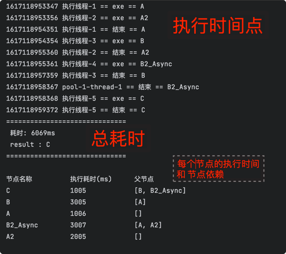
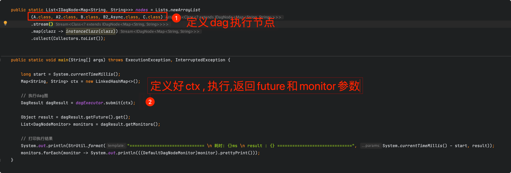

# 废弃 , 更加规范的亲使用京东的asyncTool 
> asyncTool(https://gitee.com/jd-platform-opensource/asyncTool)

---

### 实现参考dagger2的生成代码. 使用guava的listenableFuture实现图的构建.

### 使用

需要初始化一边executor,传入线程池和节点获取方式.

* 初始化的时候会获取节点对象,构建相关依赖.
* 提交任务,根据相关依赖构建图开始执行.
* 节点需要实现IDagNode接口
* 所有数据都在context中流转(不是自动生成代码有个context写起来方便)
* 节点执行前后可以添加monitor监控,实现DagNodeMonitor接口,将在几个节点执行.
* 依赖使用注解@RelyOn标识
    * value是依赖的类,如果是第一个节点,value=[]
    * 如果是最后一个节点,@RelyOn需要注明**isLastNode=true**
    * 如果是通过nio调用,dagNode返回的是future对象的话,下面的节点会等待所有的结果是future的执行完成. 主要是应用在某个节点等待的上游节点都是nio的future对象的时候,只有一个节点在等待资源,而不是上游节点都在等待自己执行完成. 减少一些线程池的使用.

#### Note

* 节点可以使固定的节点(比如spring的bean). 也可以是有状态的对象,每次获取一个新的节点对象.
* 如果其中一个节点失败,则下游相关节点会全部失败. 

调试代码可以参考test.example文件夹.

### 使用demo

### 生成节点转移图

